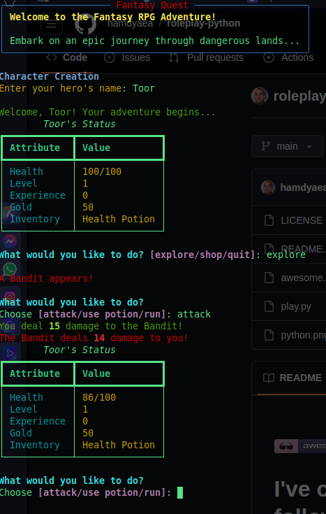

 [](https://github.com/psf/black)   
  
  

   
  
# I've created a complete text-based RPG game with the following features:      
   
Rich terminal interface with colored text and panels    
Character creation and status display  
Combat system with multiple enemies   
Inventory system   
Shop system   
Level up mechanics   
Experience and gold rewards   

## To run the game, you'll need to install the required packages:      

```bash
pip install rich click  
```   


Then you can run the game:   

```bash
python play.py
```

## The game includes:  
  
Different types of enemies (Goblin, Wolf, Bandit, Dragon)  
Combat actions (attack, use potion, run)   
A shop to buy items   
Health potions system  
Level-up mechanism  
Character statistics tracking     

### Developer   

Hamdy Abou El Anein   
hamdy.aea@protonmail.com 


